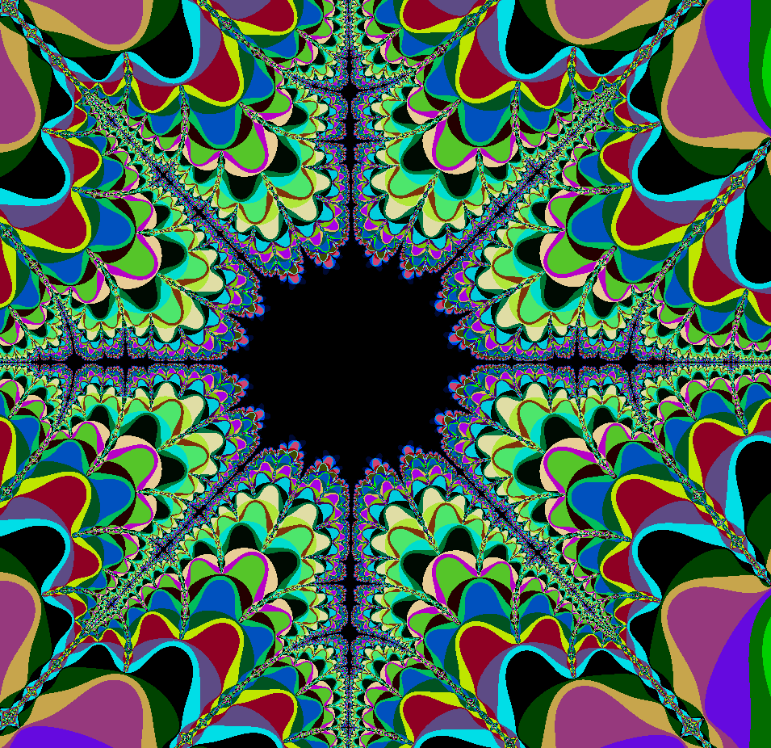

# fractaml

This is the [mandelbrot set](https://en.wikipedia.org/wiki/Mandelbrot_set) implemented in OCaml.




## External Dependencies

- [opam](https://opam.ocaml.org/)
- [npm](https://nodejs.org/en/)

## How to run Fractaml

To execute the program, you first need `opam` to install the dependencies:

```bash
opam switch create . --deps-only
eval $(opam env)

```

To run:

```bash
dune build
npx serve

```

Go to `localhost:3000` to check out the fractal.

## Developers

- EduardoLR10
- ribeirotomas1904
- MMagueta

## Dr.Nekoma

Built live on [twitch](https://www.twitch.tv/drnekoma) and archived on [youtube](https://www.youtube.com/channel/UCMyzdYsPiBU3xoqaOeahr6Q)
